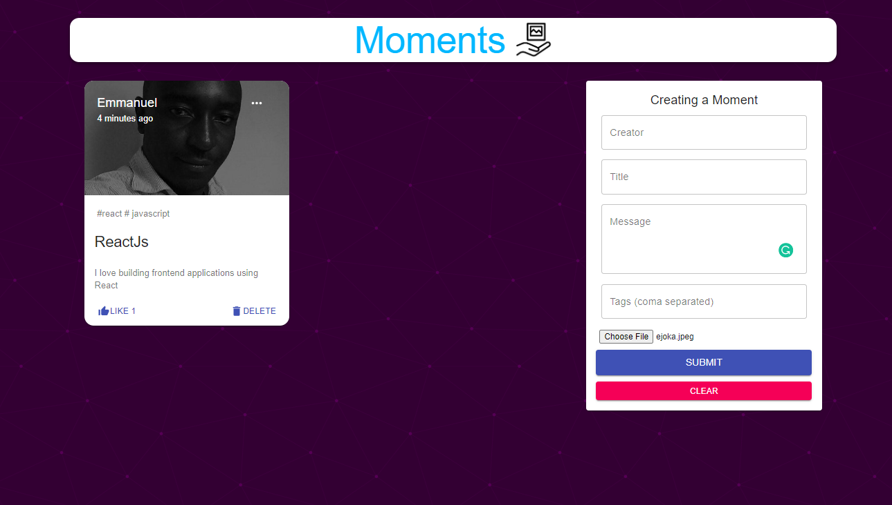

# Project: Building an API

In this project, I will be building an API using NodeJS and Express. It's just a simple API with data of names of different people with their ages.

 

## Built With

- NodeJS
- Express

## Documentation

[Documentation of the API](#)

## Getting Started

Open your terminal or text editor and use next command

        git clone https://github.com/emmanuelkamala/Node_Express_API.git

        cd Node_Express_API

        Run 'npm install' command to install package dependencies.

## Run the app

To run the app and test the project; 
You will need a REST Client to test the endpoints. And for that I will recommend [Postman](https://postman.com/).

After downloading postman and installing it, then go to the root of the app enter this command on the command line:
'npm start'

Then open postman and use this link to start accessing the app:
http://localhost:3000/

After if you want to do any changes please create new branch, after changes open pull request.
Happy coding!

## Author

👤 **Author1**

- Github: [emmanuelkamala](https://github.com/emmanuelkamala)
- Twitter: [ejkamala](https://twitter.com/ejkamala)
- Linkedin: [emmanuelkamala](https://linkedin.com/in/emmanuelkamala)

## 🤝 Contributing

Contributions, issues and feature requests are welcome!

Feel free to check the [issues page](issues/).

## Show your support

Give a ⭐️ if you like this project!

## 📝 License

This project is [MIT](lic.url) licensed.
